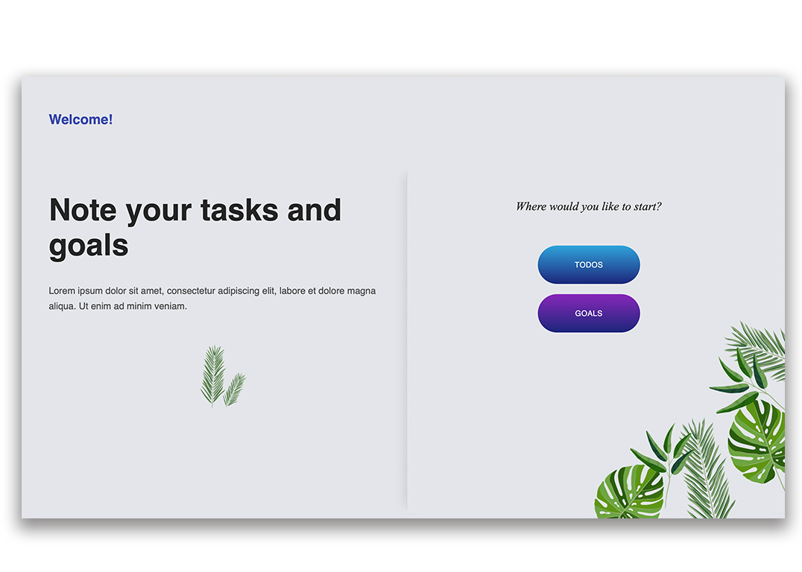

# Tasks App

Tasks: todos and goals app built with React, Redux and Webpack.

Functionalities

- Switching between goals and todos
- Adding, removing goals and todos
- Defining complexity,
- Filtering by status: all, complete, incomplete
- Selecting favorites

## To get started

- clone repository with `git clone`
- go to the project directory with `cd`
- install dependecies `npm install`
- start development server `npm run dev-server`
- to build production version run `npm run build`

## Covered Topics

- Creating application structure
- Application state management with redux
- Webpack configuration for development and production
- Styling UI components with Material UI (MUI), sass and Styled Components
- Optimization and lazy loading
- and much more
