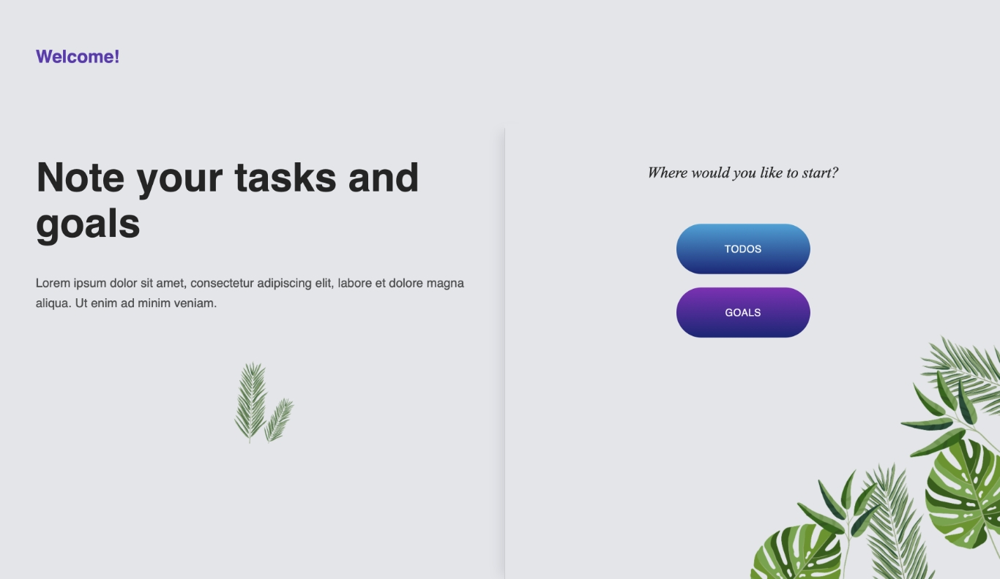
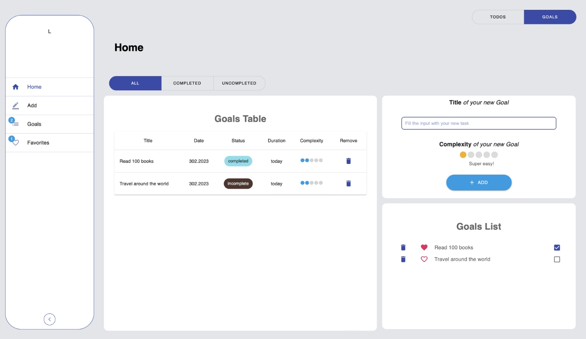

# Tasks App Project

## To get started

### clone repository with `git clone`

### go to the right directory

### install all project dependencies with `npm install`

### start the development server with `npm run dev-server`

### build with `npm run build`

You should see Start Page like below

and Home Page like below

